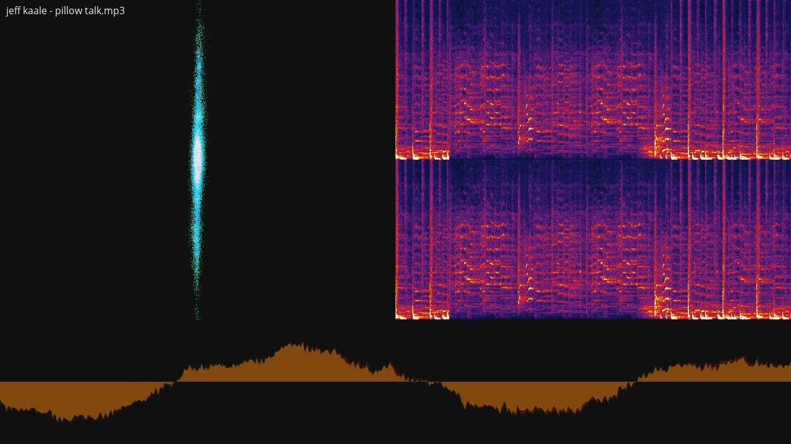

# FFmpeg-Spectrum-Chart

## Описание
Bat скрипт при помощи библиотеки ffmpeg преобразовывает звук в видео, на котором будет присутстовать:
- название файла
- 3 визуализации формы волны

Скрипт для ютуб канала: __Проверка музыки на АП__

На момент публикации репозитория у канала:
- 54 подписчика
- __56 289__ просмотров

Если трек с __Авторскими правами__ - меняется название видео (приписывается приставка __АП__ слева)

А визуализация нужна, чтоб было интересней смотреть и слушать!

## Create Video from Audio file generating a spectrum chart
``
ffmpeg -i input.mp3 -filter_complex "[0:a]avectorscope=s=640x518,pad=1280:720[vs];  [0:a]showspectrum=mode=separate:color=intensity:scale=cbrt:s=640x518[ss];  [0:a]showwaves=s=1280x202:mode=line[sw];  [vs][ss]overlay=w[bg];  [bg][sw]overlay=0:H-h,drawtext=fontfile=opensans.ttf:fontcolor=white:x=10:y=10:text='Song Title by Artist'[out]" -map "[out]" -map 0:a -c:v libx264 -preset fast -crf 18 -c:a copy output.mkv
``

[Оригинал](https://github.com/gitrust/ffmpeg-scripts/tree/master/createvideofromaudio)

## Моя версия (поддержка сразу нескольких mp3)
``
for %%a in ("*.mp3") do ffmpeg -i "%%a" -filter_complex "[0:a]avectorscope=s=640x518,pad=1280:720[vs];  [0:a]showspectrum=mode=separate:color=intensity:scale=cbrt:s=640x518[ss];  [0:a]showwaves=s=1280x202:mode=line[sw];  [vs][ss]overlay=w[bg];  [bg][sw]overlay=0:H-h,drawtext=fontfile=opensans.ttf:fontcolor=white:x=10:y=10:text='%%a'[out]" -map "[out]" -map 0:a -c:v libx264 -preset fast -crf 18 -c:a copy "%%~na.mkv"
``

## Требования
- [FFmpeg](https://ffmpeg.org/download.html#build-windows)
- Примерный видео-урок [как установить FFmpeg в переменные среды](https://youtu.be/ZrZFDlj253U)

## Использование
- Поместить любое кол-во __*.mp3__ в папку
- Скачать и поместить cmd-bat.bat в папку к аудио
- Запустить __cmd-bat.bat__
- Дождаться закрытия консоли с ffmpeg (рендер видео)
- Получаем __output.mkv__

## Ссылки
Ютуб канал: https://www.youtube.com/channel/UCdv-Kc23A6xq74mBACCR-gg

Репо: https://github.com/gitalexhubuser/FFmpeg-Spectrum-Chart
